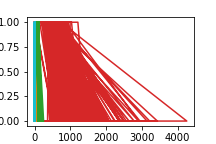
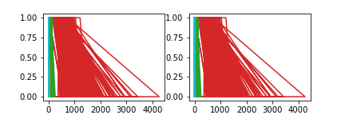
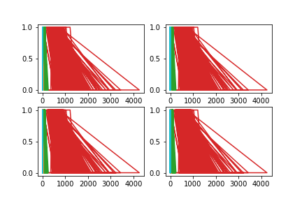

# 「Pythonで始める機械学習」のメモ

------------------------------------------------------------------------------
書籍が提供しているデータセット等便利パッケージ

```sh
pip install mglearn
```

------------------------------------------------------------------------------

## Chapter

+ [Chapter1 はじめに](./doc/Chapter1.md)
+ [Chapter2 教師あり学習](./doc/Chapter2.md)

------------------------------------------------------------------------------

## その他

+ Jupyter Notebook を Atom で動かす Hydrogen がとても便利．
+ [matplotlibの基本的な使い方](https://qiita.com/Morio/items/d75159bac916174e7654)
+ pandasのscatter_matrixがいい感じ

  ```python
  dataframe = pd.DataFrame(X, columns=data.feature_names)
  pd.scatter_matrix(dataframe, c=y, figsize=(16,16), hist_kwds={'bins':40}, s=10, alpha=.8)
  ```

### よく使うコード

#### import

```py
import numpy as np
import matplotlib.pyplot as plt
%matplotlib inline

# import mglearn as mg
```

#### `scikit-learn` が提供するデータセット

```py
# 例
from sklearn.datasets import load_breast_cancer
cancer = load_breast_cancer()
X, y = cancer.data, cancer.target
```

#### データセットの分割

```py
from sklearn.model_selection import train_test_split
X_train, X_test, y_train, y_test = train_test_split(cancer.data, cancer.target, random_state=42)
```

#### 相関行列の表示

```py
import pandas as pd
cancer_df = pd.DataFrame(X_train, columns=cancer.feature_names)
pd.scatter_matrix(cancer_df, c=y_train, figsize=(16,16), hist_kwds={'bins':40}, s=60, alpha=.8)
```

### matplotlib

`figure` の上に `plot`が複数乗る感じ．


+ `figure`を2つ用意する場合

  ```py
  # figure 1 つ目
  plt.figure(figsize=(3, 2))
  # 1つしか置かないのでsubplotは不要
  plt.plot(x, y1)

  # figure 2 つ目
  plt.figure(figsize=(3, 2))
  # 1つしか置かないのでsubplotは不要
  plt.plot(x, y2)
  ```

   

  画像は`figure`ごとに出力される．

+ `figure`1つに`plot`2つが乗る場合
  ```py
  plt.figure(figsize=(6, 2)) # figureの縦横の大きさ

  # subplot(行の数,列の数,何番目に配置しているか)
  plt.subplot(1,2,1) # 1行2列のレイアウトとしたときの1番目
  plt.plot(x, y1)

  plt.subplot(1,2,2) # 1行2列のレイアウトとしたときの2番目
  plt.plot(x, y2)
  ```

  

+ `figure`1つのうえに4つ`plot`する(`ax`で指定する方法)
  ```py
  fig, ax = plt.subplots(2, 2, figsize=(6, 4))

  # 左上
  ax[0, 0].plot(x, y1)

  # 右上
  ax[0, 1].plot(x, y2)

  # 左下
  ax[1, 0].plot(x, y3)

  # 右下
  ax[1, 1].plot(x, y4)
  ```

  


+ `ravel()`で一次元のインデックスでアクセスできる
  ```py
  fig, axes = plt.subplots(2, 2, figsize=(6, 4))
  ax = axes.ravel()  # 1次元でアクセスできる

  for i in range(len(ax)):
      ax[i].plot(x,y)
  ```
  

参考: https://qiita.com/tsuruokax/items/90167693f142ebb55a7d

### matplotlib.pyplotのメモ

+ `plt.ylim(-25, 25)` : y軸の表示範囲を制限する
+ `plt.hlines(8, 10, 42)` : y=8の傾き0の水平線を, x=10からx=42まで引く

+ 散布図

  ```py
  X.shape # (100,2)
  y.shape # (100,)

  plt.legend(["Class 0", "Class 1"], loc=4)
  plt.xlabel("First feature")
  plt.ylabel("Second feature")
  plt.scatter(X[:, 0], X[:, 1], c=y, marker='o')
  ```

  特徴量が1次元の場合はplotでもOK

  ```py
  X.shape
  y.shape

  plt.xlabel("Feature")
  plt.ylabel("Target")
  plt.plot(X, y, 'o')
  ```

+ トレリス(分割する)

  ```py
  # plt.subplots(行数, 列数, figsize=(5,10))
  fig, axis = plt.subplots(3, 1, figsize=(8,16)) # 3行1列に分割
  # このあと，axis 内の各 axに対して描画処理を行う

  # np.reshape(newshape)
  # Gives a new shape to an array without changing its data.
  # reshape(n,m) => n行 m列にする．-1を指定すると要素数を元によしなにやってくれる
  line = np.linspace(-3, 3, 1000).reshape(-1, 1) # 1000行1列
  for n, ax in zip([1,3,9], axis): # axは描画先
      reg = KNeighborsRegressor(n_neighbors=n).fit(X_train, y_train)
      ax.plot(line, reg.predict(line)) # -3 から 3 までのデータを評価
      ax.plot(X_train, y_train, '^', c=mg.cm2(0), markersize=8)
      ax.plot(X_test,  y_test,  'v', c=mg.cm2(1), markersize=8)

      ax.set_title(
          "n={}, train_score={:.2f}, test_score={:.2f}".format(n, reg.score(X_train, y_train), reg.score(X_test, y_test)))
      ax.set_xlabel("Feature")
      ax.set_ylabel("Target")

  # 最初のグラフにだけレジェンドを表示する．plotした後じゃないとだめなのでここで．
  axis[0].legend(["Model predictions", "Training data/target", "Test data/target"], loc="best")
  ```

### 用語とか

+ クラス分類: ラベルの予測．選択肢の中からクラスラベルを予測すること
+ 回帰: 連続値の予測．量を予測する．
+ 過剰適合(overfitting): 情報量に比べて過度に複雑なモデルを作ってしまうこと
+ 適合不足(underfitting): 単純すぎるモデルを選択してしまうこと
+ 特徴量エンジニアリング(feature engineering): 測定結果としての特徴量間の積(交互作用)から導出した新たな特徴量を含めること．
+ 学習曲線(learning curve): モデルの性能をデータセットサイズの関数として示したもの
+ 訓練セットのスコアが高く，テストセットのスコアが低い場合，過剰適合の可能性が高い．
+ 訓練セットとテストセットの精度がとても近い場合，適合不足の可能性が高い．
+ 適合不足の場合は複雑なモデルになるよう調整する
+ 過剰適合の場合はシンプルなモデルになるよう調整する
+ `COO(Coodinate)-format` : 0成分を省略したフォーマット．メモリ効率が良い．
+ 2値データ: 特徴量ごとに非ゼロをカウントした疎なデータ
+ カウントデータ: (文中の単語数などの)整数カウントした疎なデータ
+ アンサンブル法: 複数の機械学習モデルを組み合わせること．ランダムフォレストと勾配ブースティング決定木がよく知られている．
+ 特徴量のスケール: 線形モデル，SVM，MLPでは入力する各特徴量を，正規化等でスケールを合わせておく必要がある．
