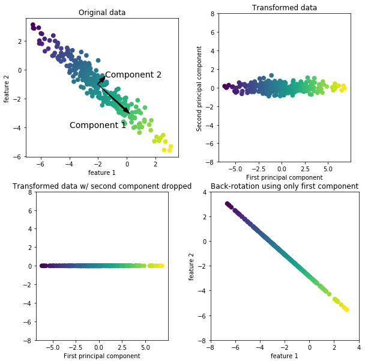
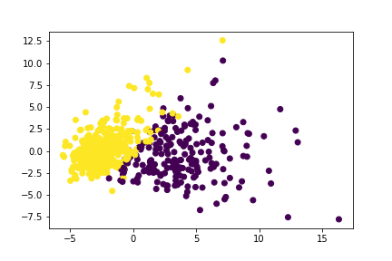

# 3章 教師なし学習

------------------------------------------------------------------------------

教師なし学習の分類

+ 教師なし変換(Unsupervised transformation): 元のデータを人や機械学習アルゴリズムがわかりやすいデータへ自動的に変換するアルゴリズム．特徴量の次元削減など．

+ クラスタリングアルゴリズム(Clustering algorithms): 似たようなデータをグループ分けするアルゴリズム．

教師なし学習は正解データ(ラベル)が与えられないため，モデルの評価が難しい．
自動システムの一部としてではなく，データサイエンティストがデータを理解するために探索的に用いる場合がある．教師あり学習の前処理としても使う．

------------------------------------------------------------------------------

## スケール変換

------------------------------------------------------------------------------

教師データで作成(適用)したスケーラを用いて，訓練データもスケールする必要がある．

スケール変換による前処理がモデルに与える影響は大きく，SVCの例だと，MinMaxScalerを通すだけでスコアが0.63から0.97まで向上した．

### StandardScaler

各特徴量が平均0, 分散1になるようにスケーリングする．
最大値最小値をある値の範囲に入れようとしない．

### RobustScaler
ここの特徴量をある値の範囲に収めようとする．
平均・分散の代わりに，中央値と四分位数を用いる．
四分位数の外にある外れ値を除去してくれる．(他のスケーリングで外れ値は問題になる)

### MinMaxScaler

```py
from sklearn.preprocessing import MinMaxScaler
scaler = MinMaxScaler()

X_train_scaled = scaler.fit_transform(X_train)
# X_train_scaled = scaler.fit(X_train).transform(X_train) # 上記と同等
```

データの最小値が0，最大値が1になるよう，0から1の範囲にすべてのデータが入るようにスケールする．

### Normalizer
各データポイントの特徴ベクトルのユークリッド長が1になるように変換する．(すべてのデータポイントを半径1の超球面へ射影する)
言い換えると `x = [x1, x2, ... xn]`のとき，`sqrt( x1^2 + x2^2 + ... + xn^2 ) = 1` となるように，`x`を変換する.

特徴ベクトルの長さではなく，方向のみに関心がある場合に用いられる．

------------------------------------------------------------------------------

## 次元削減，特徴量抽出，多様体学習

### 主成分分析(PCA: Principal component analysis)
```py
from sklearn.decomposition import PCA
pca = PCA(n_components=2)
X_pca = pca.fit_transform(X_scaled)
```



データセットの特徴量を相互に統計的に関連しないように回転する．

+ データセットの分散が最も大きい方向を第一主成分(Component 1)とし，それと直交する方向のうち最も分散が大きい方向を第二主成分(Component 2)とする．主成分は互いに直交している，互いに相関はない．
+ これを繰り返して主成分を抽出する．一般に，もとの特徴量と同じだけ主成分を抽出できるが，必要なものだけ残すことで次元を削減できる．
+ こうして見つけた主成分を特徴とする(回転)．

PCAは次元削減の他に，高次元データセットの可視化にも使える．主成分2つでプロットした例．．



今回のデータではたまたま，線形にある程度分離できそうに見えるので，線形のクラス分類アルゴリズムが使えそう・・・といった感じで当たりをつけていくのに使える．

主成分は元の特徴量の組み合わせであるため説明が難しい．

`pca.components_`で主成分ごとに，元の特徴量に対する係数を確認できる．(値が大きいほど，対応する元の特徴量の影響が大きい)


##### パラメータ
+ `n_components`: 残したい主成分の数


------------------------------------------------------------------------------

## Keywords

+ 四分位数: 大小関係によってデータセットを1:3または3:1に分割する値．
  + 第1四分位数: `大3:小1` に分割する値(下側)
  + 第3四分位数: `大1:小3` に分割する値(上側)

+ 外れ値(outliner):
+ 正規化: データ等々を一定のルール（規則）に基づいて変形すること